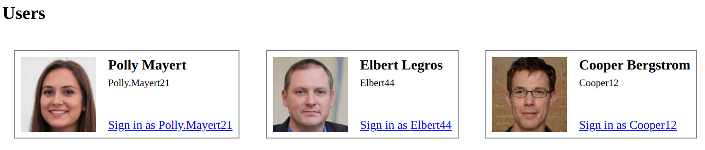
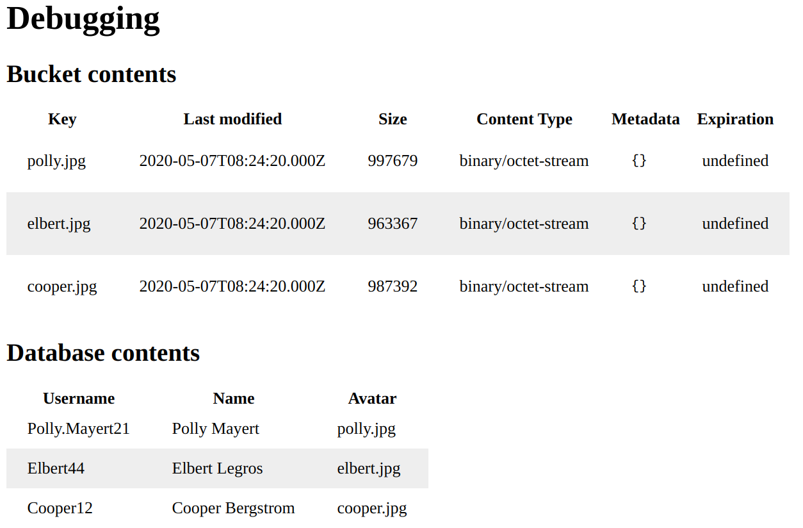
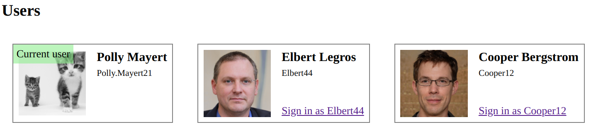
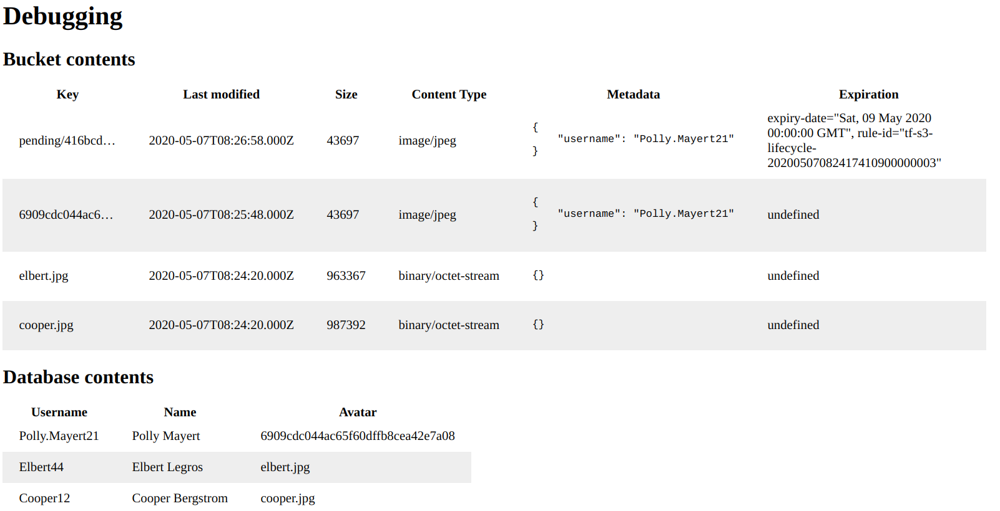

# Demo project to show how to use a 3-phase fetch to update a database value after uploading a file using a presigned POST

## How it works

In this demo system there are users and they can upload new images for their avatars. The upload itself uses presigned POST requests and the current images are referenced from a DynamoDB table.

When a user uploads a new image, it uses a 3-phase fetch:

* First, it requests a presigned POST URL from the backend
* Second, it uploads the image directly to the S3 bucket using the POST URL
* Third, it notifies the backend that the image has been uploaded and it should update the DynamoDB table to reflect the new value

### Security

An ```upload-token``` value is generated when the browser requests a presigned POST URL and that is added to the object. When the browser sends the third fetch, it must present this value and this proves that the upload was done by the same user.

A Status=Pending object tag is also added to the uploaded object and a bucket lifecycle rule makes sure it is cleaned after a few days. When the database is updated this tag is removed.

If a user accidentally or deliberately does not send the third request, the old image will be used and the uploaded file will be deleted automatically.

## How to deploy

### Prerequisites

* terraform

### Deploy

* ```terraform init```
* ```terraform apply```
* go to the resulting URL

### Cleanup

* ```terraform destroy```

## How to use

On the top of the page you can see the users in the database:



On the bottom of the page there are 2 tables, one to show the S3 bucket contents, and the other one for the DynamoDB table. Use these to inspect the backend state.

Initially, there are 3 files for the 3 users, and the ```Avatar``` column in the DynamoDB table joins them:



### Upload a new image

First, log in as one of the users. The page reloads and you'll see the file inputs become active. Choose a file and wait for the page to reload.

You'll see the image of the user is changed:



And the database and the bucket are updated too:


Notice that old image is deleted and the new image is referenced from the DynamoDB table.

Under the hood, the 3 fetches can be observed in the devtools:


### Errors

If any of the 2 fetches are producing an error then nothing permanent happens. The backend does not keep track of presigned URLs and if the upload was unsuccessful then an object won't be stored in the S3 bucket. But what happens if the third fetch is missing, either accidentally (the browser crashed) or deliberately?

When the image is uploaded, it gets the Status=Pending tag and a bucket lifecycle rule cleans it up after a few days. To observe how it works, use the second file input which skips the third fetch.

When using that input, observe that the avatar is not changed and there is a new object stored in the bucket:



Notice that it has the Status=Pending tag and there is an expiration time. S3 will automatically delete this object.

On the S3 console, a lifecycle rule looks like this:


And the expiring object:


The user data is generated with [Faker.js](https://github.com/marak/Faker.js/). The initial avatar images are from [https://thispersondoesnotexist.com/](https://thispersondoesnotexist.com/). The cat image is from [https://thecatapi.com/](https://thecatapi.com/).
